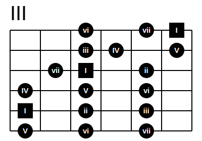

# fretty

Fretty is a guitar fretboard generator.


## Installation

    pip install fretty

## Usage

how to run fretty:

    fretty example/C-major-scale-box1.ft -o C-major-scale-box1.svg

This will produce the file C-major-scale-box1.svg

## Basic Format

```
III
- - o - o #
- - o o - o
- o # - o -
o - o - o -
# - o - o -
o - o - o -
```

The first line is the position of the starting fret.
Every line which follows is the representation on string.

* 'o' is a node
* '#' is a note as square shape
* '-' is an empty place


* numbers are displayed as notes

```
II
-5--
---3
--71
3--5
71--
-5--
```


* '|' is for a barre note
* 'X' is a muted string

```
III
|---
|o--
|-o-
|-o-
|---
X---
```


* '+' is a open string

```
I
--o-
---o
--o-
+---
X---
X---
```


## Extended Format

You can enclose any text with branches.
* '(' - ')' for circle notes
* '[' - ']' for square notes

```
III
  -    -    (vi)    -   (vii)  [I]
  -    -    (iii)  (IV)   -    (V)
  -  (vii)  [I]     -    (ii)   -
(IV)   -    (V)     -    (vi)   -
[I]    -    (ii)    -    (iii)  -
(V)    -    (vi)    -    (vii)  -
```



If you close the note by using the barre synbol, instead of the closing branch,
the note will be part of a barre symbol.

```
V
(5|   -   -   -
|    (3)  -   -
(7|   -   -   -
|     -  (5)  -
(1|   -   -   -
X     -   -   -
```


## Additional Information

This project was inspired by 
[svguitar](https://github.com/omnibrain/svguitar).