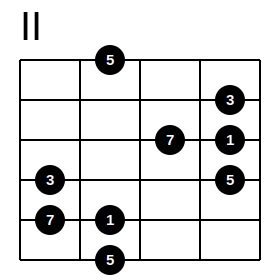

# fretty

Fretty is a guitar fretboard generator.

how to run fretty:

    ./fretty.py my-scale.ft -o my-scale.svg

This will produce the file my-scale.svg

```
III
- - o - o #
- - o o - o
- o # - o -
o - o - o -
# - o - o -
o - o - o -
```

The first line is the position of the starting fret.
Every line which follows is the representation on string.

* 'o' is a node
* '#' is a note as square shape
* '-' is an empty place


* numbers are displayed as notes

```
II
-5--
---3
--71
3--5
71--
-5--
```



* '|' is for a barre note
* 'X' is a muted string

```
III
|---
|o--
|-o-
|-o-
|---
X---
```

